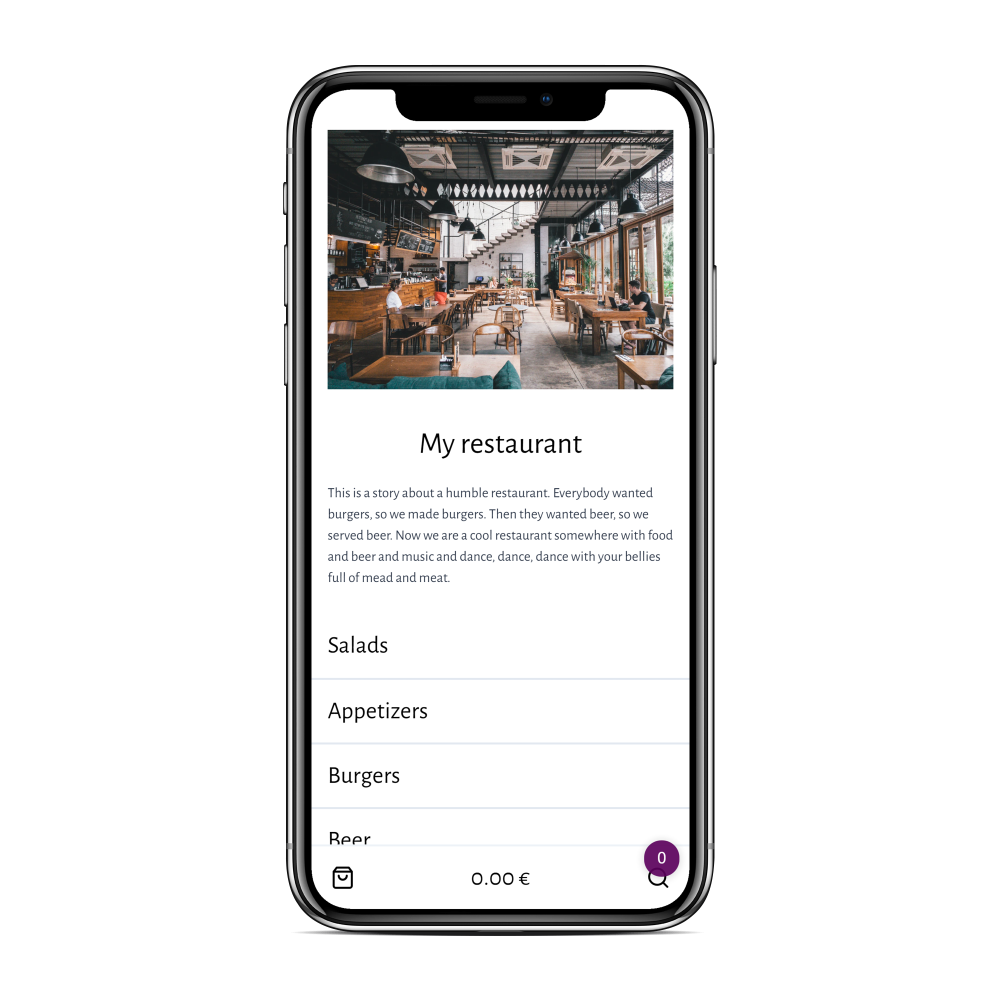
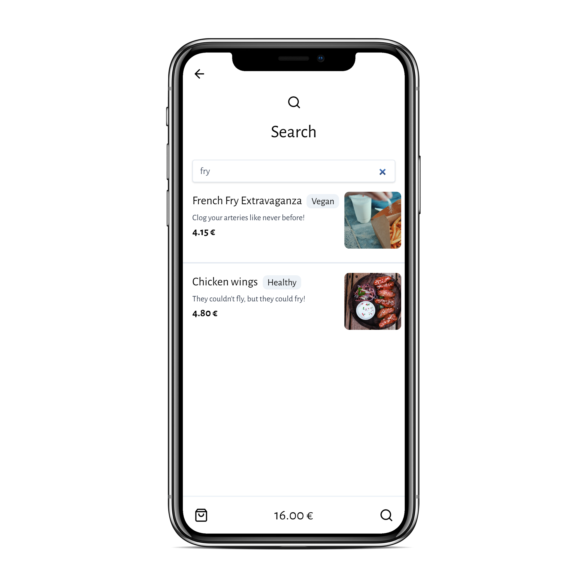
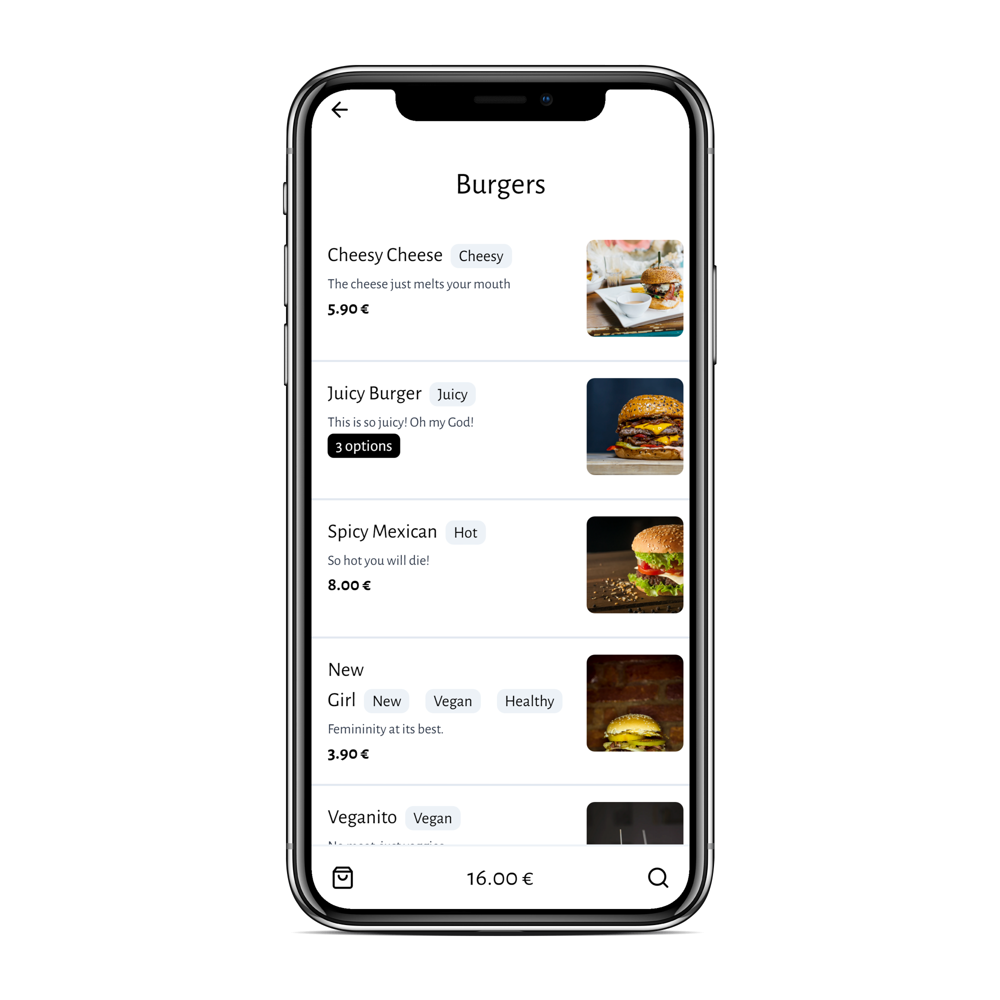
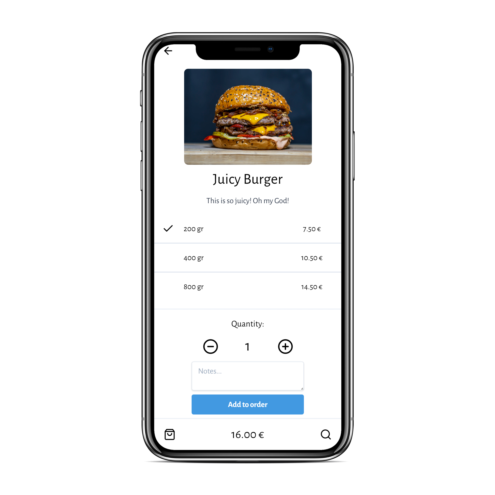
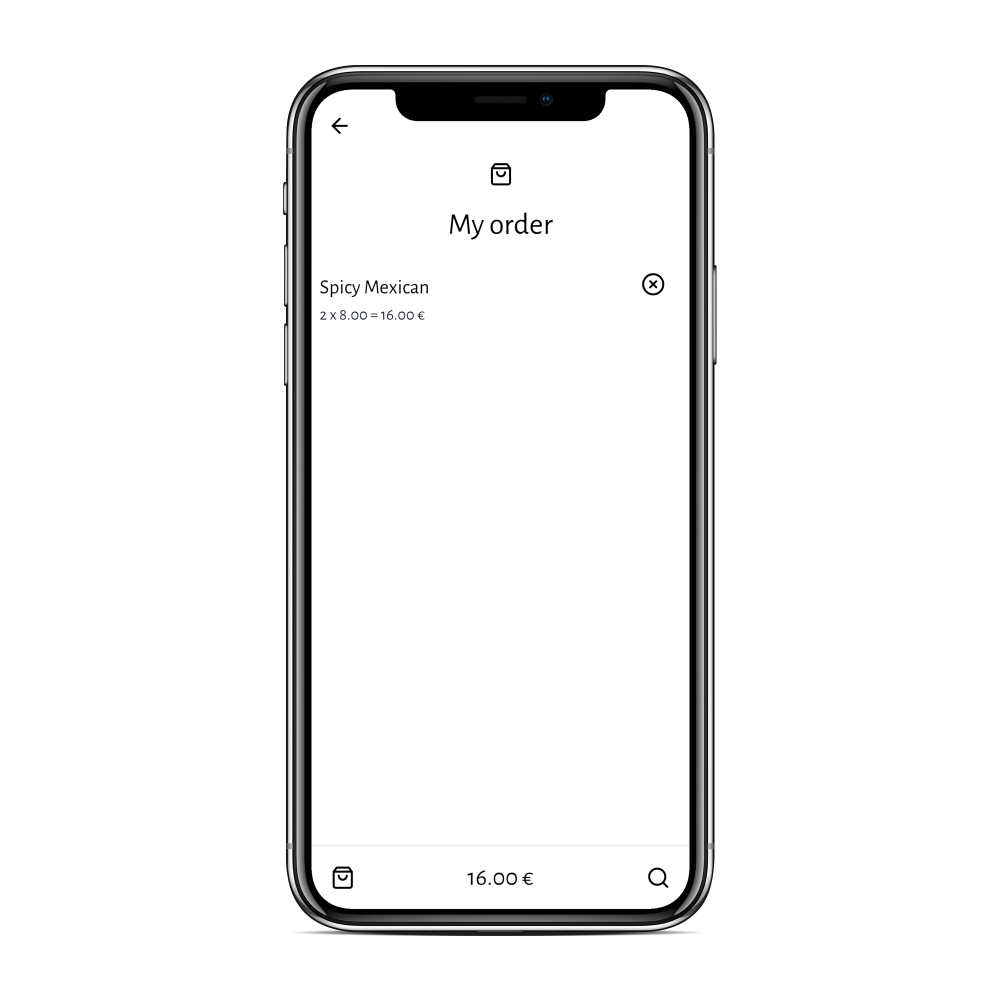

  
  <h1>dishmi</h1>
  
e-Menu application

  

## Features

**dishmi** provides an easy way to create an electronic menu for your restaurant, cafe or bar to improve customer experience and make sure your menu is always up to date. Current features include, but are not limited to:

- Menu item categorization
- Menu item description and images
- Menu item tagging
- Menu item variations
- Responsive design that fits all devices
- More features coming soon...

  
  

## How to use

For information on how to add your restaurant, please open an issue in this repository and we will be right with you.

  
  

## FAQ

### What was the motivation behind this project?

Due to the COVID-19 pandemic, contact with physical menus is a potential infection vector we could easily avoid. That and the fact that restaurant menus have a variety of needs that are hard to deal with on paper prompted us to develop this prototype.

### What is the cost for hosting my menu?

Currently, there is no cost associated with hosting your menu, except for a little bit of effort to create the menu in a compatible format. Other than that, it's entirely free. This might change in the future, as the project scales, but we'll inform you way ahead of time.

## Credits

Made using [Gatsby](https://www.gatsbyjs.com/) by [@Trinityyi](https://github.com/Trinityyi) and [@Chalarangelo](https://github.com/Chalarangelo).
Hosted on [Netlify](https://www.netlify.com/).

## License

The project is licensed under the MIT License.
